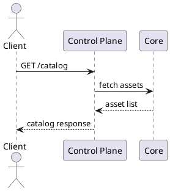

# Connector Setup & Testing Guide

This guide explains how to configure, run, and test the Lightweight Dataspace Connector. It covers local and Docker-based setups for the control plane and data plane and provides an overview of the system design using selected views of the 4+1 model.

## Prerequisites

- **Node.js:** 20.x LTS
- **pnpm:** 8.x
- **Git** and **Docker:** 24.x (optional for container deployment)
- **PostgreSQL** and **Redis** (available via `docker compose`)

## Local Setup

1. **Install dependencies**
   ```bash
   pnpm install
   ```
2. **Start backing services**
   ```bash
   docker compose up -d postgres redis
   pnpm db:migrate
   ```
3. **Run the control plane** (default port `3000`)
   ```bash
   pnpm --filter @connector/control-plane dev
   ```
4. **Run the data plane** (default port `3001`)
   ```bash
   pnpm --filter @connector/data-plane dev
   ```
5. **Verify catalog endpoint**
   ```bash
   curl http://localhost:3000/catalog
   ```

## Docker Setup

1. **Start infrastructure services**
   ```bash
   docker compose up -d
   ```
2. **Build the connector image**
   ```bash
   docker build -t connector .
   ```
3. **Run the connector**
   ```bash
   docker run --rm --env-file .env -p 3000:3000 -p 3001:3001 connector
   ```

## Available Commands

### Root Project
- `pnpm lint` – run ESLint
- `pnpm format` – format code with Prettier
- `pnpm build` – compile all packages
- `pnpm test` – run all unit tests

### Per Package
Use `--filter` to target a package:
```bash
pnpm --filter @connector/control-plane dev|build|lint|test
pnpm --filter @connector/data-plane dev|build|lint|test
```

## Design Overview (4+1 Model)

### Logical View
```plantuml
@startuml
package "Control Plane" {
  [API Server] as CP
}
package "Data Plane" {
  [Transfer Service] as DP
}
package "Core" {
  [Domain Models] as Core
}
package "Shared" {
  [Utilities] as Shared
}
CP --> Core
CP --> Shared
DP --> Core
DP --> Shared
@enduml
```

### Process View – Catalog Retrieval


## Running Unit Tests

Run all tests:
```bash
pnpm test
```
Run tests for a specific package:
```bash
pnpm --filter @connector/control-plane test
pnpm --filter @connector/data-plane test
```

Tests are executed with [Vitest](https://vitest.dev/).
