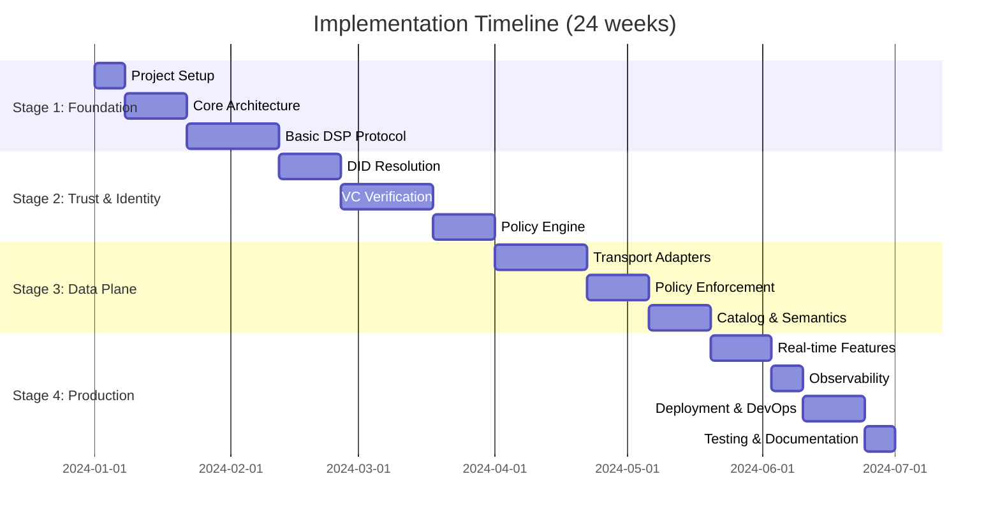

# Implementation Stages - Lightweight Dataspace Connector

## Implementation Strategy Overview

Based on the **phased MVP approach**, the implementation is divided into 4 main stages:

1. **Stage 1: Foundation & Core DSP** - Basic DSP protocol implementation
2. **Stage 2: Trust & Identity** - Verifiable credentials and DID resolution
3. **Stage 3: Data Plane & Adapters** - Transport adapters and policy enforcement
4. **Stage 4: Advanced Features & Production** - Real-time features, optimization, and deployment

Each stage builds upon the previous one, ensuring working functionality at each milestone.

---

## Stage 1: Foundation & Core DSP (6 weeks)

**Goal:** Establish project foundation and implement basic DSP protocol endpoints.

**Duration:** 6 weeks  
**Dependencies:** None  
**Team Size:** 2-3 developers

### Sub-stages:

#### 1.1 Project Setup & Infrastructure (Week 1)
**Duration:** 1 week  
**Dependencies:** None

**Tasks:**
- [x] Initialize monorepo with pnpm workspaces
- [ ] Set up TypeScript configuration with project references
- [ ] Configure ESLint, Prettier, and Husky pre-commit hooks
- [ ] Set up basic CI/CD pipeline (GitHub Actions)
- [ ] Create Docker development environment
- [ ] Set up PostgreSQL and Redis containers
- [ ] Initialize core packages structure
- [ ] Create shared TypeScript types and interfaces
- [ ] Set up logging framework (pino)
- [ ] Configure environment management (convict)

**Deliverables:**
- Working development environment
- Basic project structure
- CI/CD pipeline
- Development documentation

**Acceptance Criteria:**
- `pnpm install` and `pnpm dev` work without errors
- All linting and formatting rules pass
- Docker containers start successfully
- Basic health check endpoints respond

#### 1.2 Core Architecture Implementation (Weeks 2-3)
**Duration:** 2 weeks  
**Dependencies:** 1.1 completion

**Tasks:**
- [ ] Implement base entity classes and domain models
- [ ] Create repository pattern interfaces and PostgreSQL implementations
- [ ] Set up Fastify applications for CP and DP
- [ ] Implement dependency injection container
- [ ] Create event bus for internal communication
- [ ] Set up database migrations with Prisma
- [ ] Implement configuration management
- [ ] Create error handling middleware
- [ ] Set up request/response validation with JSON Schema
- [ ] Implement basic health check and readiness endpoints

**Deliverables:**
- Core domain models
- Database schema and migrations
- Basic CP and DP applications
- Configuration system

**Acceptance Criteria:**
- Applications start and connect to database
- Health checks return 200 OK
- Basic CRUD operations work
- Configuration loads from environment

#### 1.3 Basic DSP Protocol Implementation (Weeks 4-6)
**Duration:** 3 weeks  
**Dependencies:** 1.2 completion

**Tasks:**
- [ ] Implement DSP message schemas and validation
- [ ] Create catalog endpoint with basic dataset/service listings
- [ ] Implement contract negotiation state machine
- [ ] Create negotiation endpoints (POST/GET /dsp/negotiations)
- [ ] Implement agreement endpoints (POST/GET /dsp/agreements)
- [ ] Create transfer process endpoints (POST/GET /dsp/transfers)
- [ ] Add JSON-LD context processing
- [ ] Implement basic participant self-description
- [ ] Create DSP client for peer communication
- [ ] Add request/response correlation and tracing
- [ ] Implement basic error handling and status codes
- [ ] Create integration tests for DSP endpoints

**Deliverables:**
- Working DSP catalog endpoint
- Contract negotiation flow
- Transfer process management
- DSP client library

**Acceptance Criteria:**
- Catalog returns valid JSON-LD responses
- Contract negotiation completes successfully
- Transfer processes can be created and tracked
- DSP client can communicate with peer connectors
- All endpoints pass DSP schema validation

**Stage 1 Milestone:**
- Basic DSP-compliant connector
- Can list assets in catalog
- Can negotiate simple contracts
- Can initiate transfers
- Passes basic DSP conformance tests

---

## Stage 2: Trust & Identity (7 weeks)

**Goal:** Implement verifiable credentials verification, DID resolution, and policy engine.

**Duration:** 7 weeks  
**Dependencies:** Stage 1 completion  
**Team Size:** 3-4 developers

### Sub-stages:

#### 2.1 DID Resolution Framework (Weeks 7-8)
**Duration:** 2 weeks  
**Dependencies:** Stage 1 completion

**Tasks:**
- [ ] Implement base DID resolver interface
- [ ] Create did:web resolver with HTTP(S) resolution
- [ ] Add DID document caching with Redis
- [ ] Implement DID document validation
- [ ] Create key extraction from DID documents
- [ ] Add support for multiple key formats (JWK, PEM)
- [ ] Implement DID resolution caching strategy
- [ ] Create DID resolver registry for pluggable resolvers
- [ ] Add error handling for resolution failures
- [ ] Create unit tests for DID resolution
- [ ] Add integration tests with real did:web identifiers
- [ ] Document DID resolution configuration

**Deliverables:**
- DID resolution framework
- did:web resolver implementation
- Caching layer
- Comprehensive tests

**Acceptance Criteria:**
- Can resolve did:web identifiers
- Caching reduces resolution time by >80%
- Handles network failures gracefully
- Validates DID document structure

#### 2.2 Verifiable Credentials Verification (Weeks 9-11)
**Duration:** 3 weeks  
**Dependencies:** 2.1 completion

**Tasks:**
- [ ] Implement VC/VP parsing for JSON-LD format
- [ ] Add SD-JWT VC format support
- [ ] Create signature verification for different algorithms (ES256, RS256)
- [ ] Implement OID4VP presentation verification
- [ ] Add challenge/response validation
- [ ] Create trust chain validation
- [ ] Implement revocation checking (status list, CRL)
- [ ] Add claims extraction and mapping
- [ ] Create role mapping from VC claims
- [ ] Implement VC caching for performance
- [ ] Add support for Gaia-X credentials
- [ ] Create comprehensive VC validation tests
- [ ] Add mock wallet for testing
- [ ] Document VC verification flows

**Deliverables:**
- Multi-format VC verifier
- OID4VP implementation
- Trust chain validation
- Claims mapping system

**Acceptance Criteria:**
- Verifies JSON-LD and SD-JWT VCs
- Validates OID4VP presentations
- Extracts claims correctly
- Maps claims to internal roles
- Handles revoked credentials

#### 2.3 Policy Engine Implementation (Weeks 12-13)
**Duration:** 2 weeks  
**Dependencies:** 2.2 completion

**Tasks:**
- [ ] Implement ODRL policy parser and validator
- [ ] Create policy decision point (PDP) engine
- [ ] Add constraint evaluation (purpose, time, geo, count)
- [ ] Implement conflict resolution algorithms
- [ ] Create policy administration point (PAP)
- [ ] Add policy versioning and management
- [ ] Implement policy caching for performance
- [ ] Create policy template system
- [ ] Add obligation extraction and planning
- [ ] Implement policy composition rules
- [ ] Create policy validation and testing framework
- [ ] Add policy decision audit logging
- [ ] Document policy configuration and usage

**Deliverables:**
- ODRL policy engine
- Policy decision point
- Constraint evaluators
- Policy management system

**Acceptance Criteria:**
- Parses and validates ODRL policies
- Evaluates complex constraints correctly
- Resolves policy conflicts
- Caches decisions for performance
- Logs all policy decisions

**Stage 2 Milestone:**
- VC-based authentication working
- DID resolution for multiple methods
- Policy engine enforcing ODRL constraints
- Trust chain validation
- Claims-based authorization

---

## Stage 3: Data Plane & Adapters (7 weeks)

**Goal:** Implement transport adapters, policy enforcement, and semantic catalog.

**Duration:** 7 weeks  
**Dependencies:** Stage 2 completion  
**Team Size:** 3-4 developers

### Sub-stages:

#### 3.1 Transport Adapters (Weeks 14-16)
**Duration:** 3 weeks  
**Dependencies:** Stage 2 completion

**Tasks:**
- [ ] Create transport adapter interface and registry
- [ ] Implement HTTP/HTTPS adapter for REST APIs
- [ ] Add S3-compatible storage adapter (AWS S3, MinIO)
- [ ] Create MQTT adapter for IoT data streams
- [ ] Implement basic Kafka adapter for event streaming
- [ ] Add WebDAV adapter for file system access
- [ ] Create adapter configuration management
- [ ] Implement transfer planning and execution
- [ ] Add progress tracking and resumable transfers
- [ ] Create adapter health monitoring
- [ ] Implement connection pooling and retry logic
- [ ] Add comprehensive adapter testing
- [ ] Create adapter development guide
- [ ] Document adapter configuration

**Deliverables:**
- Transport adapter framework
- HTTP, S3, MQTT, Kafka adapters
- Transfer execution engine
- Adapter registry

**Acceptance Criteria:**
- All adapters handle their protocols correctly
- Transfers can be paused and resumed
- Connection failures are handled gracefully
- Progress is tracked accurately
- Adapters are hot-pluggable

#### 3.2 Policy Enforcement Points (Weeks 17-18)
**Duration:** 2 weeks  
**Dependencies:** 3.1 completion

**Tasks:**
- [ ] Implement data plane policy enforcement point (PEP)
- [ ] Create runtime policy evaluation
- [ ] Add constraint enforcement (rate limiting, geo-fencing)
- [ ] Implement obligation execution framework
- [ ] Create duty executors (notify, delete, watermark)
- [ ] Add usage tracking and quota management
- [ ] Implement policy guard middleware
- [ ] Create enforcement context building
- [ ] Add enforcement decision caching
- [ ] Implement enforcement audit logging
- [ ] Create enforcement testing framework
- [ ] Add performance monitoring for enforcement
- [ ] Document enforcement configuration

**Deliverables:**
- Policy enforcement points
- Duty executors
- Usage tracking system
- Enforcement middleware

**Acceptance Criteria:**
- Policies are enforced at runtime
- Obligations are executed correctly
- Usage is tracked accurately
- Enforcement decisions are cached
- All enforcement actions are audited

#### 3.3 Catalog & Semantics (Weeks 19-20)
**Duration:** 2 weeks  
**Dependencies:** 3.2 completion

**Tasks:**
- [ ] Implement semantic catalog with JSON-LD support
- [ ] Add DCAT-AP metadata handling
- [ ] Create SHACL validation for offers
- [ ] Implement full-text search capabilities
- [ ] Add semantic search with SPARQL (optional)
- [ ] Create catalog federation support
- [ ] Implement offer lifecycle management
- [ ] Add catalog synchronization with peers
- [ ] Create catalog API with filtering and pagination
- [ ] Implement catalog caching strategies
- [ ] Add catalog backup and restore
- [ ] Create catalog management UI (basic)
- [ ] Document catalog configuration and usage

**Deliverables:**
- Semantic catalog service
- SHACL validation
- Search capabilities
- Federation support

**Acceptance Criteria:**
- Catalog stores and retrieves JSON-LD metadata
- SHACL validation works correctly
- Search returns relevant results
- Federation synchronizes with peers
- Offers can be managed through API

**Stage 3 Milestone:**
- Data transfers working through multiple protocols
- Policies enforced in real-time
- Semantic catalog with search
- Federation with other connectors
- Complete DSP workflow functional

---

## Stage 4: Advanced Features & Production (4 weeks)

**Goal:** Add real-time features, observability, and production deployment.

**Duration:** 4 weeks  
**Dependencies:** Stage 3 completion  
**Team Size:** 4-5 developers

### Sub-stages:

#### 4.1 Real-time Features (Weeks 21-22)
**Duration:** 2 weeks  
**Dependencies:** Stage 3 completion

**Tasks:**
- [ ] Implement subscriptions API for real-time data
- [ ] Create standing agreements with selectors
- [ ] Add tickets API for short-lived access tokens
- [ ] Implement watermark-based streaming
- [ ] Create subscription scheduler with RRULE support
- [ ] Add WebSocket support for real-time notifications
- [ ] Implement streaming data adapters
- [ ] Create subscription management interface
- [ ] Add subscription health monitoring
- [ ] Implement backpressure handling
- [ ] Create real-time testing framework
- [ ] Document real-time features

**Deliverables:**
- Subscriptions API
- Standing agreements
- Tickets system
- Real-time streaming

**Acceptance Criteria:**
- Subscriptions work with various schedules
- Standing agreements authorize multiple transfers
- Tickets provide secure short-term access
- Streaming handles backpressure correctly
- Real-time notifications are delivered

#### 4.2 Observability & Monitoring (Week 23)
**Duration:** 1 week  
**Dependencies:** 4.1 completion

**Tasks:**
- [ ] Implement OpenTelemetry instrumentation
- [ ] Add Prometheus metrics collection
- [ ] Create distributed tracing with Jaeger
- [ ] Implement structured logging with correlation IDs
- [ ] Add performance monitoring and alerting
- [ ] Create health check dashboard
- [ ] Implement audit log export
- [ ] Add evidence bundle generation
- [ ] Create monitoring documentation
- [ ] Set up log aggregation
- [ ] Add security monitoring and alerts

**Deliverables:**
- Complete observability stack
- Metrics and tracing
- Audit logging
- Monitoring dashboards

**Acceptance Criteria:**
- All operations are traced
- Metrics are collected and visualized
- Logs are structured and searchable
- Alerts fire for critical issues
- Evidence bundles are generated correctly

#### 4.3 Deployment & DevOps (Weeks 24-25)
**Duration:** 2 weeks  
**Dependencies:** 4.2 completion

**Tasks:**
- [ ] Create production Docker images
- [ ] Implement Kubernetes Helm charts
- [ ] Add database migration automation
- [ ] Create deployment pipelines
- [ ] Implement blue-green deployment
- [ ] Add infrastructure as code (Terraform)
- [ ] Create backup and disaster recovery procedures
- [ ] Implement security scanning in CI/CD
- [ ] Add performance testing automation
- [ ] Create deployment documentation
- [ ] Set up production monitoring
- [ ] Create operational runbooks

**Deliverables:**
- Production deployment system
- Helm charts
- CI/CD pipelines
- Operational documentation

**Acceptance Criteria:**
- Deployments are automated and reliable
- Zero-downtime deployments work
- Backups are automated and tested
- Security scans pass
- Performance meets requirements

#### 4.4 Testing & Documentation (Week 26)
**Duration:** 1 week  
**Dependencies:** 4.3 completion

**Tasks:**
- [ ] Complete end-to-end testing suite
- [ ] Add performance and load testing
- [ ] Create DSP conformance test suite
- [ ] Implement security penetration testing
- [ ] Complete API documentation
- [ ] Create user guides and tutorials
- [ ] Add developer documentation
- [ ] Create troubleshooting guides
- [ ] Implement automated documentation generation
- [ ] Add example configurations and use cases

**Deliverables:**
- Complete test suite
- Comprehensive documentation
- User guides
- Developer resources

**Acceptance Criteria:**
- All tests pass consistently
- Documentation is complete and accurate
- Examples work out of the box
- Performance meets SLA requirements
- Security tests pass

**Stage 4 Milestone:**
- Production-ready connector
- Complete observability
- Automated deployment
- Comprehensive documentation
- DSP conformance certified

---

## Cross-Cutting Implementation Considerations

### Development Practices

#### Code Quality
- **Test-Driven Development:** Write tests before implementation for complex logic
- **Code Reviews:** All code must be reviewed by at least one other developer
- **Static Analysis:** Use ESLint, TypeScript strict mode, and SonarQube
- **Documentation:** JSDoc for all public APIs, README for each package

#### Version Control
- **Git Flow:** Feature branches, pull requests, protected main branch
- **Semantic Versioning:** Follow semver for all packages
- **Conventional Commits:** Use conventional commit messages
- **Release Notes:** Automated generation from commit messages

#### Testing Strategy
- **Unit Tests:** >80% code coverage for business logic
- **Integration Tests:** Test component interactions
- **End-to-End Tests:** Test complete user workflows
- **Performance Tests:** Automated performance regression testing

### Risk Mitigation

#### Technical Risks
- **Complexity Risk:** Break down complex features into smaller tasks
- **Integration Risk:** Early integration testing with mock services
- **Performance Risk:** Performance testing from Stage 1
- **Security Risk:** Security review at each stage gate

#### Schedule Risks
- **Dependency Risk:** Parallel development where possible
- **Resource Risk:** Cross-training team members
- **Scope Risk:** Clear acceptance criteria and change control
- **Quality Risk:** Automated testing and continuous integration

### Success Metrics

#### Stage 1 Success Criteria
- Basic DSP endpoints functional
- Can negotiate simple contracts
- Database and caching working
- CI/CD pipeline operational

#### Stage 2 Success Criteria
- VC verification working with real wallets
- DID resolution for did:web
- Policy engine enforcing basic constraints
- Trust chain validation functional

#### Stage 3 Success Criteria
- Data transfers through multiple protocols
- Real-time policy enforcement
- Semantic catalog with federation
- Complete DSP workflow end-to-end

#### Stage 4 Success Criteria
- Production deployment successful
- Performance meets requirements
- Security audit passed
- DSP conformance certified
- Documentation complete

This phased approach ensures working functionality at each stage while building toward a complete, production-ready dataspace connector that meets all PRD requirements.