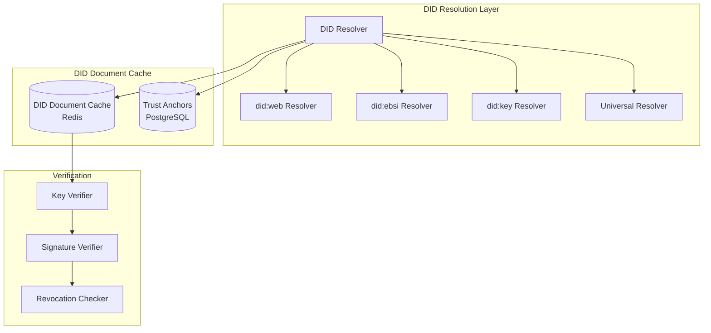
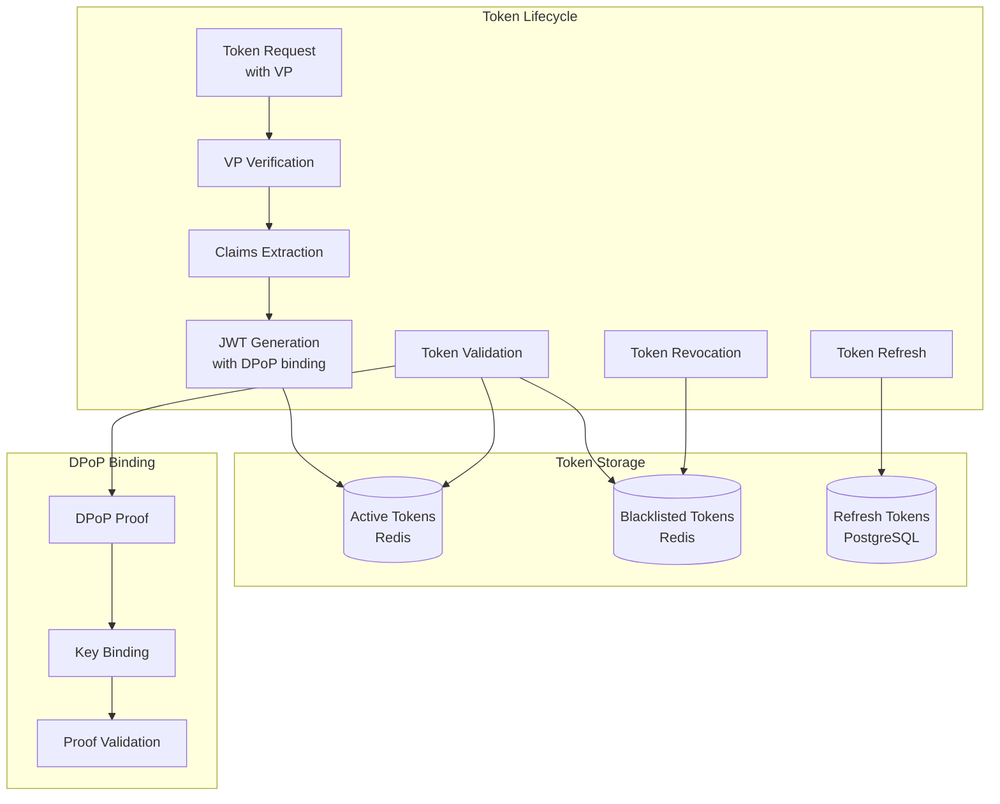
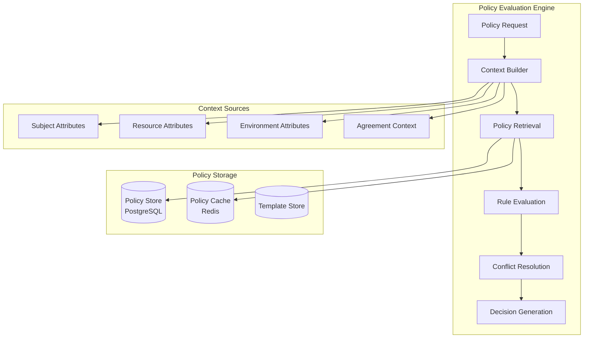

# Security & Authentication Architecture - Lightweight Dataspace Connector

## Security Overview

The connector implements a multi-layered security architecture based on:
- **Zero Trust principles** - Never trust, always verify
- **Verifiable Credentials (VC)** for identity and authorization
- **DID-based identity** with cryptographic verification
- **Policy-based access control** with ODRL enforcement
- **End-to-end encryption** for data in transit and at rest
- **Comprehensive audit logging** for compliance and forensics

## Identity & Trust Architecture

### 1. DID (Decentralized Identifier) Resolution



#### DID Resolution Implementation

```typescript
interface DIDResolver {
  resolve(did: string): Promise<DIDDocument>;
  supports(did: string): boolean;
  verify(document: DIDDocument): Promise<VerificationResult>;
}

class CompositeDIDResolver implements DIDResolver {
  private resolvers: Map<string, DIDResolver> = new Map();
  private cache: DIDDocumentCache;
  
  constructor(cache: DIDDocumentCache) {
    this.cache = cache;
    this.registerResolver('web', new WebDIDResolver());
    this.registerResolver('ebsi', new EBSIDIDResolver());
    this.registerResolver('key', new KeyDIDResolver());
  }
  
  async resolve(did: string): Promise<DIDDocument> {
    // Check cache first
    const cached = await this.cache.get(did);
    if (cached && !this.isExpired(cached)) {
      return cached.document;
    }
    
    const method = this.extractMethod(did);
    const resolver = this.resolvers.get(method);
    
    if (!resolver) {
      throw new UnsupportedDIDMethodError(method);
    }
    
    const document = await resolver.resolve(did);
    await this.cache.set(did, document, this.getTTL(method));
    
    return document;
  }
}
```

### 2. Verifiable Credentials Verification

```mermaid
graph TB
    subgraph "VC Verification Pipeline"
        VPReceiver[VP Receiver]
        FormatDetector[Format Detector]
        
        subgraph "Format Handlers"
            SDJWTHandler[SD-JWT VC Handler]
            JSONLDHandler[JSON-LD VC Handler]
            MDLHandler[ISO mDL Handler]
        end
        
        subgraph "Verification Steps"
            SyntaxValidator[Syntax Validator]
            SignatureVerifier[Signature Verifier]
            TrustChainValidator[Trust Chain Validator]
            RevocationChecker[Revocation Checker]
            PolicyValidator[Policy Validator]
        end
        
        subgraph "Claims Processing"
            ClaimsExtractor[Claims Extractor]
            RoleMapper[Role Mapper]
            AttributeValidator[Attribute Validator]
        end
    end
    
    VPReceiver --> FormatDetector
    FormatDetector --> SDJWTHandler
    FormatDetector --> JSONLDHandler
    FormatDetector --> MDLHandler
    
    SDJWTHandler --> SyntaxValidator
    JSONLDHandler --> SyntaxValidator
    MDLHandler --> SyntaxValidator
    
    SyntaxValidator --> SignatureVerifier
    SignatureVerifier --> TrustChainValidator
    TrustChainValidator --> RevocationChecker
    RevocationChecker --> PolicyValidator
    
    PolicyValidator --> ClaimsExtractor
    ClaimsExtractor --> RoleMapper
    RoleMapper --> AttributeValidator
```



#### VC Verification Implementation

```typescript
interface VerifiableCredentialVerifier {
  verifyPresentation(vp: string, challenge: string, domain: string): Promise<VerificationResult>;
  extractClaims(vp: string): Promise<ClaimSet>;
  checkRevocation(credential: VerifiableCredential): Promise<RevocationStatus>;
}

class OID4VPVerifier implements VerifiableCredentialVerifier {
  constructor(
    private didResolver: DIDResolver,
    private trustStore: TrustStore,
    private revocationService: RevocationService
  ) {}
  
  async verifyPresentation(vp: string, challenge: string, domain: string): Promise<VerificationResult> {
    try {
      // 1. Parse and validate VP structure
      const presentation = await this.parsePresentation(vp);
      
      // 2. Verify VP signature
      const holderDID = presentation.holder;
      const holderDocument = await this.didResolver.resolve(holderDID);
      const vpSignatureValid = await this.verifyVPSignature(presentation, holderDocument);
      
      if (!vpSignatureValid) {
        return { valid: false, error: 'Invalid VP signature' };
      }
      
      // 3. Verify challenge and domain
      if (presentation.proof.challenge !== challenge || presentation.proof.domain !== domain) {
        return { valid: false, error: 'Challenge or domain mismatch' };
      }
      
      // 4. Verify each credential in the presentation
      const credentialResults = await Promise.all(
        presentation.verifiableCredential.map(vc => this.verifyCredential(vc))
      );
      
      const invalidCredentials = credentialResults.filter(r => !r.valid);
      if (invalidCredentials.length > 0) {
        return { valid: false, error: 'Invalid credentials in presentation', details: invalidCredentials };
      }
      
      // 5. Extract and validate claims
      const claims = await this.extractClaims(vp);
      const claimsValid = await this.validateClaims(claims);
      
      return {
        valid: claimsValid.valid,
        claims: claims,
        holder: holderDID,
        credentials: presentation.verifiableCredential.map(vc => vc.id),
        error: claimsValid.error
      };
      
    } catch (error) {
      return { valid: false, error: error.message };
    }
  }
  
  private async verifyCredential(credential: VerifiableCredential): Promise<VerificationResult> {
    // 1. Verify credential signature
    const issuerDID = credential.issuer;
    const issuerDocument = await this.didResolver.resolve(issuerDID);
    const signatureValid = await this.verifyCredentialSignature(credential, issuerDocument);
    
    if (!signatureValid) {
      return { valid: false, error: 'Invalid credential signature' };
    }
    
    // 2. Check trust chain
    const trustChainValid = await this.trustStore.isTrusted(issuerDID);
    if (!trustChainValid) {
      return { valid: false, error: 'Untrusted issuer' };
    }
    
    // 3. Check revocation status
    const revocationStatus = await this.revocationService.checkStatus(credential);
    if (revocationStatus.revoked) {
      return { valid: false, error: 'Credential revoked' };
    }
    
    // 4. Check expiration
    if (credential.expirationDate && new Date(credential.expirationDate) < new Date()) {
      return { valid: false, error: 'Credential expired' };
    }
    
    return { valid: true };
  }
}
```

### 3. Trust Store Management

```typescript
interface TrustStore {
  addTrustAnchor(anchor: TrustAnchor): Promise<void>;
  isTrusted(did: string): Promise<boolean>;
  getTrustChain(did: string): Promise<TrustChain>;
  revokeTrust(anchorId: string): Promise<void>;
  updateRevocationList(anchorId: string): Promise<void>;
}

class PostgreSQLTrustStore implements TrustStore {
  constructor(private db: Database) {}
  
  async addTrustAnchor(anchor: TrustAnchor): Promise<void> {
    await this.db.query(`
      INSERT INTO trust_anchors (name, description, anchor_type, did, certificate_pem, 
                                public_key_jwk, trust_framework, status, valid_from, valid_until)
      VALUES ($1, $2, $3, $4, $5, $6, $7, $8, $9, $10)
    `, [
      anchor.name, anchor.description, anchor.type, anchor.did,
      anchor.certificatePem, anchor.publicKeyJwk, anchor.trustFramework,
      anchor.status, anchor.validFrom, anchor.validUntil
    ]);
  }
  
  async isTrusted(did: string): Promise<boolean> {
    // Check if DID is directly trusted
    const directTrust = await this.db.query(`
      SELECT id FROM trust_anchors 
      WHERE did = $1 AND status = 'active' 
      AND (valid_until IS NULL OR valid_until > NOW())
    `, [did]);
    
    if (directTrust.rows.length > 0) {
      return true;
    }
    
    // Check trust chain through certificate hierarchy
    return await this.checkTrustChain(did);
  }
}
```

## Authentication & Authorization Architecture

### 1. JWT Token Management with DPoP



#### JWT with DPoP Implementation

```typescript
interface TokenService {
  generateToken(claims: ClaimSet, dpopKey: JsonWebKey): Promise<AccessToken>;
  validateToken(token: string, dpopProof: string): Promise<TokenValidationResult>;
  refreshToken(refreshToken: string): Promise<AccessToken>;
  revokeToken(token: string): Promise<void>;
}

class DPoPTokenService implements TokenService {
  constructor(
    private jwtService: JWTService,
    private tokenStore: TokenStore,
    private config: TokenConfig
  ) {}
  
  async generateToken(claims: ClaimSet, dpopKey: JsonWebKey): Promise<AccessToken> {
    const jti = crypto.randomUUID();
    const now = Math.floor(Date.now() / 1000);
    
    const payload = {
      iss: this.config.issuer,
      sub: claims.subject,
      aud: this.config.audience,
      exp: now + this.config.accessTokenTTL,
      iat: now,
      jti: jti,
      cnf: {
        jkt: await this.calculateJWKThumbprint(dpopKey) // DPoP key binding
      },
      // Custom claims from VC
      roles: claims.roles,
      attributes: claims.attributes,
      participant_id: claims.participantId,
      trust_level: claims.trustLevel
    };
    
    const token = await this.jwtService.sign(payload);
    
    // Store token metadata
    await this.tokenStore.storeToken(jti, {
      subject: claims.subject,
      dpopKeyThumbprint: payload.cnf.jkt,
      expiresAt: new Date(payload.exp * 1000),
      roles: claims.roles,
      participantId: claims.participantId
    });
    
    return {
      access_token: token,
      token_type: 'DPoP',
      expires_in: this.config.accessTokenTTL,
      scope: this.buildScope(claims.roles)
    };
  }
  
  async validateToken(token: string, dpopProof: string): Promise<TokenValidationResult> {
    try {
      // 1. Verify JWT signature and structure
      const payload = await this.jwtService.verify(token);
      
      // 2. Check if token is blacklisted
      const isBlacklisted = await this.tokenStore.isBlacklisted(payload.jti);
      if (isBlacklisted) {
        return { valid: false, error: 'Token revoked' };
      }
      
      // 3. Verify DPoP proof
      const dpopValid = await this.verifyDPoPProof(dpopProof, token, payload.cnf.jkt);
      if (!dpopValid) {
        return { valid: false, error: 'Invalid DPoP proof' };
      }
      
      // 4. Check token expiration
      if (payload.exp < Math.floor(Date.now() / 1000)) {
        return { valid: false, error: 'Token expired' };
      }
      
      return {
        valid: true,
        claims: {
          subject: payload.sub,
          participantId: payload.participant_id,
          roles: payload.roles,
          attributes: payload.attributes,
          trustLevel: payload.trust_level
        }
      };
      
    } catch (error) {
      return { valid: false, error: error.message };
    }
  }
  
  private async verifyDPoPProof(dpopProof: string, accessToken: string, expectedKeyThumbprint: string): Promise<boolean> {
    try {
      const proof = await this.jwtService.verify(dpopProof, { algorithms: ['ES256', 'RS256'] });
      
      // Verify DPoP proof structure
      if (proof.typ !== 'dpop+jwt') {
        return false;
      }
      
      // Verify HTTP method and URL (should be provided in proof)
      // This would be checked against the actual request
      
      // Verify access token hash
      const expectedAth = await this.calculateSHA256Hash(accessToken);
      if (proof.ath !== expectedAth) {
        return false;
      }
      
      // Verify key thumbprint matches
      const proofKeyThumbprint = await this.calculateJWKThumbprint(proof.header.jwk);
      if (proofKeyThumbprint !== expectedKeyThumbprint) {
        return false;
      }
      
      // Verify timestamp (prevent replay attacks)
      const now = Math.floor(Date.now() / 1000);
      if (Math.abs(now - proof.iat) > 60) { // 60 second window
        return false;
      }
      
      return true;
    } catch (error) {
      return false;
    }
  }
}
```

### 2. Role-Based Access Control (RBAC)

```typescript
interface AuthorizationService {
  authorize(request: AuthorizationRequest): Promise<AuthorizationResult>;
  checkPermission(subject: string, resource: string, action: string): Promise<boolean>;
  assignRole(subject: string, role: string): Promise<void>;
  revokeRole(subject: string, role: string): Promise<void>;
}

class PolicyBasedAuthorizationService implements AuthorizationService {
  constructor(
    private policyEngine: PolicyDecisionPoint,
    private roleService: RoleService
  ) {}
  
  async authorize(request: AuthorizationRequest): Promise<AuthorizationResult> {
    // 1. Extract subject attributes from token claims
    const subjectAttributes = await this.extractSubjectAttributes(request.token);
    
    // 2. Get resource attributes
    const resourceAttributes = await this.getResourceAttributes(request.resource);
    
    // 3. Build policy evaluation context
    const context: PolicyEvaluationContext = {
      subject: subjectAttributes,
      resource: resourceAttributes,
      action: request.action,
      environment: {
        timestamp: new Date(),
        ipAddress: request.clientIP,
        userAgent: request.userAgent
      }
    };
    
    // 4. Evaluate policies
    const decision = await this.policyEngine.evaluate(context);
    
    // 5. Log authorization decision
    await this.logAuthorizationDecision(request, decision);
    
    return {
      decision: decision.decision,
      obligations: decision.obligations,
      reason: decision.reason
    };
  }
  
  private async extractSubjectAttributes(token: TokenClaims): Promise<SubjectAttributes> {
    return {
      participantId: token.participantId,
      did: token.subject,
      roles: token.roles,
      attributes: token.attributes,
      trustLevel: token.trustLevel,
      verifiedCredentials: token.verifiedCredentials || []
    };
  }
}
```

## Policy Enforcement Architecture

### 1. Policy Decision Point (PDP)



#### ODRL Policy Engine Implementation

```typescript
interface PolicyDecisionPoint {
  evaluate(context: PolicyEvaluationContext): Promise<PolicyDecision>;
  validatePolicy(policy: ODRLPolicy): Promise<ValidationResult>;
  resolveConflicts(policies: ODRLPolicy[]): Promise<ODRLPolicy>;
}

class ODRLPolicyEngine implements PolicyDecisionPoint {
  constructor(
    private policyStore: PolicyStore,
    private constraintEvaluator: ConstraintEvaluator,
    private conflictResolver: ConflictResolver
  ) {}
  
  async evaluate(context: PolicyEvaluationContext): Promise<PolicyDecision> {
    // 1. Retrieve applicable policies
    const policies = await this.getApplicablePolicies(context);
    
    if (policies.length === 0) {
      return { decision: 'deny', reason: 'No applicable policies found' };
    }
    
    // 2. Resolve policy conflicts
    const resolvedPolicy = await this.conflictResolver.resolve(policies);
    
    // 3. Evaluate permissions
    const permissionResults = await Promise.all(
      resolvedPolicy.permission.map(permission => this.evaluatePermission(permission, context))
    );
    
    // 4. Evaluate prohibitions
    const prohibitionResults = await Promise.all(
      resolvedPolicy.prohibition?.map(prohibition => this.evaluateProhibition(prohibition, context)) || []
    );
    
    // 5. Check if any prohibition applies
    const hasApplicableProhibition = prohibitionResults.some(result => result.applies);
    if (hasApplicableProhibition) {
      return { 
        decision: 'deny',
reason: 'Action prohibited by policy',
        prohibitions: prohibitionResults.filter(r => r.applies)
      };
    }
    
    // 6. Check if any permission applies
    const applicablePermissions = permissionResults.filter(result => result.applies);
    if (applicablePermissions.length === 0) {
      return { decision: 'deny', reason: 'No applicable permissions found' };
    }
    
    // 7. Extract obligations from applicable permissions
    const obligations = applicablePermissions.flatMap(permission => permission.obligations || []);
    
    return {
      decision: 'permit',
      reason: 'Access granted by policy',
      permissions: applicablePermissions,
      obligations: obligations
    };
  }
  
  private async evaluatePermission(permission: ODRLPermission, context: PolicyEvaluationContext): Promise<PermissionEvaluationResult> {
    // Check if action matches
    if (!this.actionMatches(permission.action, context.action)) {
      return { applies: false, reason: 'Action does not match' };
    }
    
    // Check if target matches
    if (permission.target && !this.targetMatches(permission.target, context.resource.id)) {
      return { applies: false, reason: 'Target does not match' };
    }
    
    // Evaluate constraints
    if (permission.constraint) {
      const constraintResults = await Promise.all(
        permission.constraint.map(constraint => this.constraintEvaluator.evaluate(constraint, context))
      );
      
      const failedConstraints = constraintResults.filter(result => !result.satisfied);
      if (failedConstraints.length > 0) {
        return { 
          applies: false, 
          reason: 'Constraints not satisfied',
          failedConstraints: failedConstraints
        };
      }
    }
    
    return {
      applies: true,
      reason: 'Permission applies',
      obligations: permission.duty || []
    };
  }
}
```

### 2. Policy Enforcement Points (PEP)

```typescript
interface PolicyEnforcementPoint {
  enforce(request: EnforcementRequest): Promise<EnforcementResult>;
  executeObligations(obligations: Obligation[]): Promise<ObligationResult[]>;
}

class DataPlaneEnforcementPoint implements PolicyEnforcementPoint {
  constructor(
    private pdp: PolicyDecisionPoint,
    private obligationExecutor: ObligationExecutor,
    private auditLogger: AuditLogger
  ) {}
  
  async enforce(request: EnforcementRequest): Promise<EnforcementResult> {
    const startTime = Date.now();
    
    try {
      // 1. Build enforcement context
      const context = await this.buildEnforcementContext(request);
      
      // 2. Get policy decision
      const decision = await this.pdp.evaluate(context);
      
      // 3. Log enforcement decision
      await this.auditLogger.logEnforcement({
        requestId: request.id,
        subject: context.subject.did,
        resource: context.resource.id,
        action: context.action,
        decision: decision.decision,
        reason: decision.reason,
        timestamp: new Date(),
        duration: Date.now() - startTime
      });
      
      if (decision.decision === 'deny') {
        return {
          allowed: false,
          reason: decision.reason,
          httpStatus: 403
        };
      }
      
      // 4. Execute pre-obligations
      const preObligations = decision.obligations?.filter(o => o.timing === 'pre') || [];
      if (preObligations.length > 0) {
        const obligationResults = await this.obligationExecutor.execute(preObligations, context);
        const failedObligations = obligationResults.filter(r => !r.success);
        
        if (failedObligations.length > 0) {
          return {
            allowed: false,
            reason: 'Pre-obligations failed',
            failedObligations: failedObligations
          };
        }
      }
      
      return {
        allowed: true,
        obligations: decision.obligations?.filter(o => o.timing !== 'pre') || [],
        constraints: decision.constraints || []
      };
      
    } catch (error) {
      await this.auditLogger.logError({
        requestId: request.id,
        error: error.message,
        timestamp: new Date()
      });
      
      return {
        allowed: false,
        reason: 'Policy enforcement error',
        httpStatus: 500
      };
    }
  }
}
```

## Security Implementation Summary

This comprehensive security architecture provides:

1. **Identity Verification** - Multi-format VC verification with DID resolution
2. **Authentication** - JWT with DPoP binding for proof-of-possession
3. **Authorization** - ODRL-based policy engine with fine-grained access control
4. **Transport Security** - TLS 1.3 with optional mTLS for admin APIs
5. **Key Management** - JWK set rotation with secure key storage
6. **Data Protection** - Encryption at rest and PII anonymization
7. **Audit & Compliance** - Comprehensive logging for GDPR and regulatory compliance

The architecture follows zero-trust principles and provides defense-in-depth security suitable for enterprise dataspace deployments.