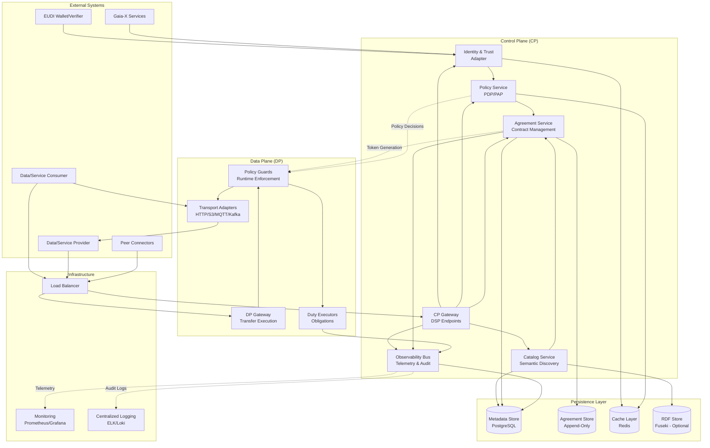
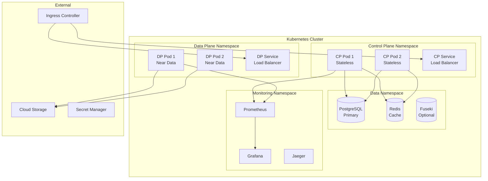

# System Architecture - Lightweight Dataspace Connector

## High-Level Architecture Overview

The Lightweight Dataspace Connector follows a strict **Control Plane (CP)** and **Data Plane (DP)** separation pattern, ensuring scalability, security, and maintainability.



## Control Plane (CP) Architecture

### CP Gateway - DSP Protocol Implementation
**Responsibility:** Expose standard DSP endpoints and handle protocol-level concerns

**Components:**
- **Route Handlers:** DSP endpoint implementations
- **Request Validation:** JSON Schema validation for DSP payloads
- **Content Negotiation:** JSON-LD context handling
- **Rate Limiting:** Per-participant rate limiting
- **CORS & Security:** Security headers and CORS policies

**Key Endpoints:**
```typescript
// DSP Core Endpoints
POST /dsp/negotiations     // Contract negotiation
GET  /dsp/negotiations/{id}
POST /dsp/agreements       // Agreement finalization
POST /dsp/transfers        // Transfer initiation
GET  /dsp/catalog          // Catalog discovery

// Extensions
POST /dsp/subscriptions    // Real-time subscriptions
POST /dsp/tickets          // Short-lived access tokens
GET  /dsp/usage/{agreementId} // Usage metrics
```

### Identity & Trust Adapter
**Responsibility:** Handle verifiable credentials, DID resolution, and trust establishment

**Components:**
- **VC Verifier:** OID4VP verification (SD-JWT VC, JSON-LD VC)
- **DID Resolver:** Multi-method DID resolution (did:web primary)
- **Trust Store:** Manage trust anchors and revocation lists
- **Claims Mapper:** Map VC claims to internal roles/attributes

**Design Pattern:** Adapter pattern for different wallet/verifier integrations

```typescript
interface VerifiableCredentialVerifier {
  verifyPresentation(vp: string, challenge: string): Promise<VerificationResult>
  resolveDID(did: string): Promise<DIDDocument>
  checkRevocation(credential: VerifiableCredential): Promise<boolean>
}
```

### Policy Service (PDP/PAP)
**Responsibility:** ODRL policy management, conflict resolution, and authorization decisions

**Components:**
- **Policy Parser:** ODRL JSON-LD parsing and validation
- **Conflict Resolver:** Policy conflict detection and resolution
- **Decision Engine:** Policy Decision Point (PDP) implementation
- **Policy Store:** Versioned policy management with caching

**Design Pattern:** Strategy pattern for different policy evaluation algorithms

```typescript
interface PolicyDecisionPoint {
  evaluate(request: AuthorizationRequest): Promise<PolicyDecision>
  validatePolicy(policy: ODRLPolicy): Promise<ValidationResult>
  resolveConflicts(policies: ODRLPolicy[]): Promise<ODRLPolicy>
}
```

### Catalog Service
**Responsibility:** Semantic catalog for datasets and services with discovery capabilities

**Components:**
- **Metadata Manager:** JSON-LD metadata storage and retrieval
- **Search Engine:** Full-text and semantic search
- **SHACL Validator:** Shape validation for offers
- **Federation Client:** Federated catalog synchronization

**Design Pattern:** Repository pattern with semantic query capabilities

### Agreement Service
**Responsibility:** Contract lifecycle management and DSP state machine implementation

**Components:**
- **State Machine:** DSP negotiation state transitions
- **Contract Store:** Immutable agreement storage
- **Signature Manager:** Digital signature verification
- **Notification Service:** Agreement status notifications

**Design Pattern:** State machine pattern with event sourcing

### Observability Bus
**Responsibility:** Telemetry collection, audit logging, and compliance reporting

**Components:**
- **Event Collector:** Internal event aggregation
- **Telemetry Exporter:** OpenTelemetry integration
- **Audit Logger:** Compliance and audit trail
- **Evidence Generator:** Contract evidence bundles

## Data Plane (DP) Architecture

### DP Gateway
**Responsibility:** Execute agreed transfers and service invocations with policy enforcement

**Components:**
- **Transfer Orchestrator:** Coordinate multi-step transfers
- **Token Validator:** Verify CP-issued access tokens
- **Request Router:** Route to appropriate adapters
- **Response Handler:** Handle provider responses and errors

### Policy Guards
**Responsibility:** Runtime policy enforcement and obligation execution

**Components:**
- **Enforcement Engine:** Real-time policy evaluation
- **Rate Limiter:** Usage-based rate limiting
- **Geo Filter:** Geographic constraint enforcement
- **Audit Trail:** Policy decision logging

**Design Pattern:** Interceptor/Middleware pattern

```typescript
interface PolicyGuard {
  enforce(context: EnforcementContext): Promise<EnforcementResult>
  checkConstraints(constraints: ConstraintKV[]): Promise<boolean>
  executeObligations(obligations: string[]): Promise<void>
}
```

### Transport Adapters
**Responsibility:** Protocol-specific data access and service invocation

**Supported Protocols:**
- **HTTP/HTTPS:** REST APIs, file downloads
- **S3/Blob Storage:** Cloud storage access
- **MQTT:** IoT and streaming data
- **Kafka:** Event streaming
- **WebDAV:** File system access
- **gRPC:** High-performance service calls

**Design Pattern:** Adapter pattern with pluggable implementations

```typescript
interface TransportAdapter {
  readonly id: string
  init(config: unknown): Promise<void>
  plan(request: TransferPlanRequest): Promise<TransferPlan>
  execute(plan: TransferPlan, context: EnforcementContext): Promise<TransferResult>
  stop(): Promise<void>
}
```

### Duty Executors
**Responsibility:** Execute ODRL obligations (notify, delete, watermark, etc.)

**Supported Duties:**
- **Notify:** Webhook notifications
- **Delete:** Secure data deletion with receipts
- **Watermark:** Data watermarking
- **Anonymize:** Data anonymization
- **Log:** Audit logging

**Design Pattern:** Command pattern for obligation execution

## Cross-Cutting Concerns

### Security Architecture
- **Authentication:** JWT tokens with DPoP binding
- **Authorization:** RBAC with VC-based claims
- **Transport Security:** TLS 1.3, optional mTLS
- **Key Management:** JWK sets with rotation support
- **Secrets Management:** Environment variables + optional Vault

### Observability Architecture
- **Metrics:** Prometheus metrics for performance monitoring
- **Tracing:** OpenTelemetry distributed tracing
- **Logging:** Structured JSON logging with correlation IDs
- **Health Checks:** Kubernetes-ready health endpoints

### Configuration Management
- **Environment-based:** Different configs for dev/test/prod
- **Schema Validation:** Validate configuration at startup
- **Hot Reload:** Runtime configuration updates where safe
- **Secrets Injection:** Secure secret management

## Deployment Architecture

### Standard Cloud Deployment (Target)



### Scalability Considerations
- **Horizontal Scaling:** Stateless CP pods can scale independently
- **Data Locality:** DP pods deployed near data sources
- **Database Scaling:** Read replicas for catalog queries
- **Cache Strategy:** Redis cluster for high availability
- **Load Balancing:** Session affinity for WebSocket connections

### High Availability
- **Multi-Zone Deployment:** Pods distributed across availability zones
- **Database Replication:** PostgreSQL streaming replication
- **Cache Clustering:** Redis Sentinel for failover
- **Circuit Breakers:** Prevent cascade failures
- **Graceful Degradation:** Fallback mechanisms for external dependencies

## Design Decisions Rationale

### 1. Strict CP/DP Separation
**Decision:** Complete separation of control and data planes
**Rationale:** 
- Enables independent scaling
- Improves security (data plane has minimal attack surface)
- Allows data plane to be deployed closer to data sources
- Simplifies compliance and audit

### 2. Event-Driven Architecture
**Decision:** Use event bus for internal communication
**Rationale:**
- Loose coupling between components
- Enables observability and audit
- Supports future microservices decomposition
- Facilitates testing and debugging

### 3. Plugin Architecture
**Decision:** Extensible adapter and executor system
**Rationale:**
- Meets PRD requirement for extensibility
- Allows custom transport protocols
- Enables industry-specific obligations
- Simplifies testing with mock adapters

### 4. Immutable Agreement Store
**Decision:** Append-only storage for agreements
**Rationale:**
- Ensures non-repudiation
- Supports audit and compliance
- Enables event sourcing patterns
- Prevents tampering with contracts

### 5. Stateless Control Plane
**Decision:** CP pods maintain no local state
**Rationale:**
- Enables horizontal scaling
- Simplifies deployment and updates
- Improves fault tolerance
- Supports blue-green deployments

This architecture provides a solid foundation for implementing the Lightweight Dataspace Connector with clear separation of concerns, scalability, and maintainability.